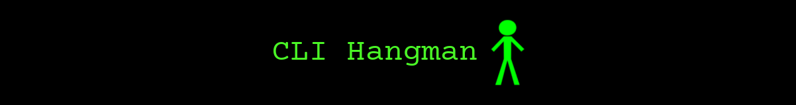
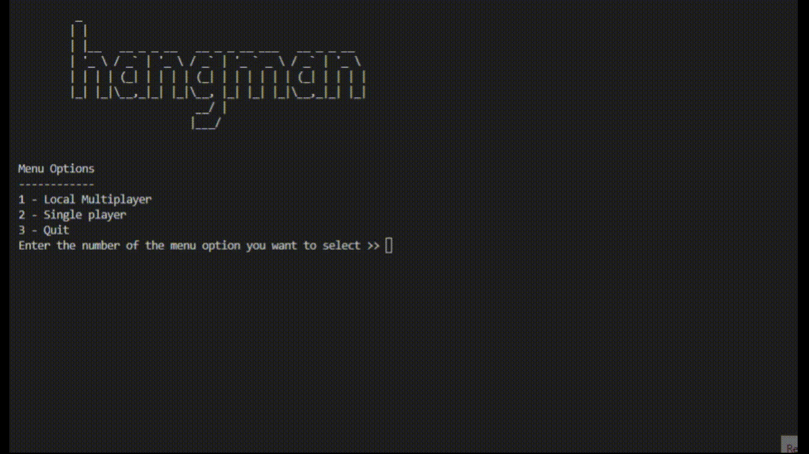
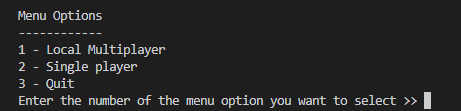
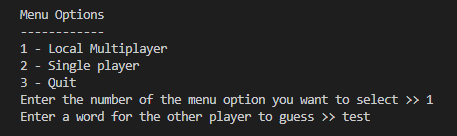
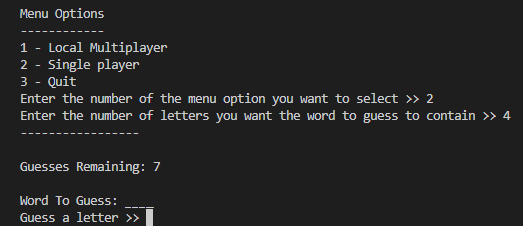

<div align="center">
    
    
    
    <p>A command-line hangman game.</p>
</div>




# Installation Guide
1. Clone this repository
```
git clone https://github.com/JoshuaBilsland/cli-hangman.git
```
2. Go into the repository
```
cd cli-hangman
```
3. [Create Python virtual environment](https://youtu.be/KxvKCSwlUv8)
4. Install dependencies
```
pip install -r requirements.txt
```
5. Run `cli_class.py`
   
# Usage Guide
The program has two game modes  

## Local Multiplayer
If option `1` is selected on the main menu then local multiplayer will be selected. In this mode, one player can type in a word for the other player to guess.  

## Single Player
If option `2` is selected on the main menu then single player will be selected. In this mode, the player enters how long of a word they want to guess. A word of that length will then be generated for them to guess.  


# Configuration Guide
## Changing the number of guesses
The `Hangman` class has been designed so that the `max_guesses` variable can be increased or decreased to make the game easier or more difficult. The `get_current_stage` method is able to 'evenly' distribute the ASCII art stage files so that the drawing of the hangman is updated in a way that is balanced with `max_guesses`. For example, if you double the number of `max_guesses`, from 7 to 14, rather than display one stage per incorrect guess, instead the next stage will be displayed after every two incorrect guesses.

To change `max_guesses`, go to the `hangman_class.py` file in the `src` folder. Go to the constructor of the class and edit the value of `self.__max_guesses`.

```
# The Hangman constructor

class Hangman:
    def __init__(self, word_to_guess):
        self.__word_to_guess = word_to_guess
        self.__max_guesses = 7  # <--------------------------- Change this 7
        self.__guesses_remaining = self.__max_guesses
        self.__letters_guessed = []
```

# Project Purpose and Aims
The main reason for creating this project is to improve my knowledge of conventions and getting into the habit of following them. I eventually want to try and get a degree apprenticeship in software development, and by learning industry conventions, it may improve my chances of getting one as well as making it easier for me to start working with a team of developers if I manage to get one. My previous projects did not really follow any industry conventions (although I was to some extent following my own that I had naturally started doing and what I had been taught at GCSEs and A-levels). Below is a list summarising the conventions I want to follow.

- Python Convention - PEP8 (https://peps.python.org/pep-0008/)
- Git Commit Message Convention - Conventional Commits (https://www.conventionalcommits.org/en/v1.0.0/)
- README Template - (https://github.com/JoshuaBilsland/my-conventions) 

For more information please see https://github.com/JoshuaBilsland/my-conventions.